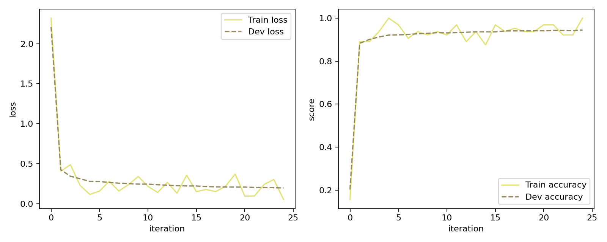
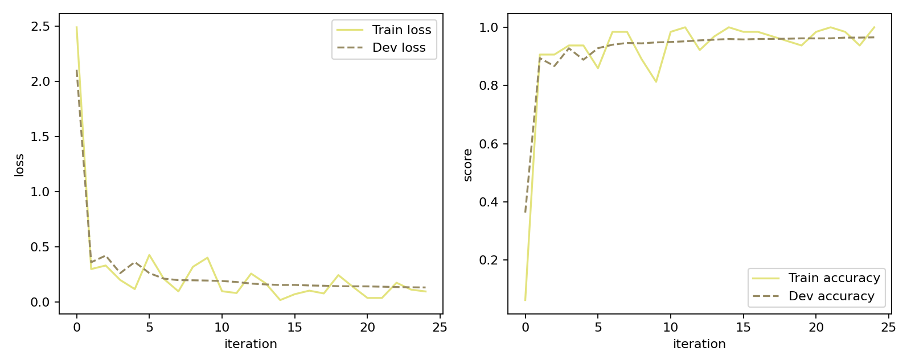
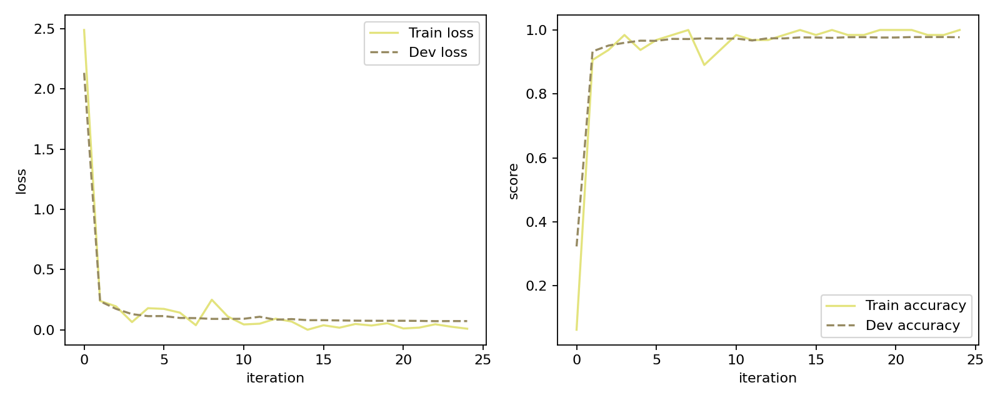
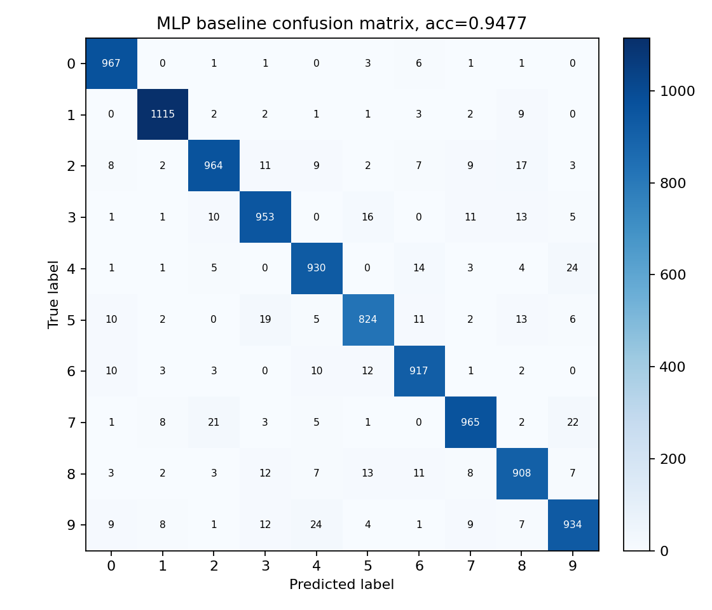
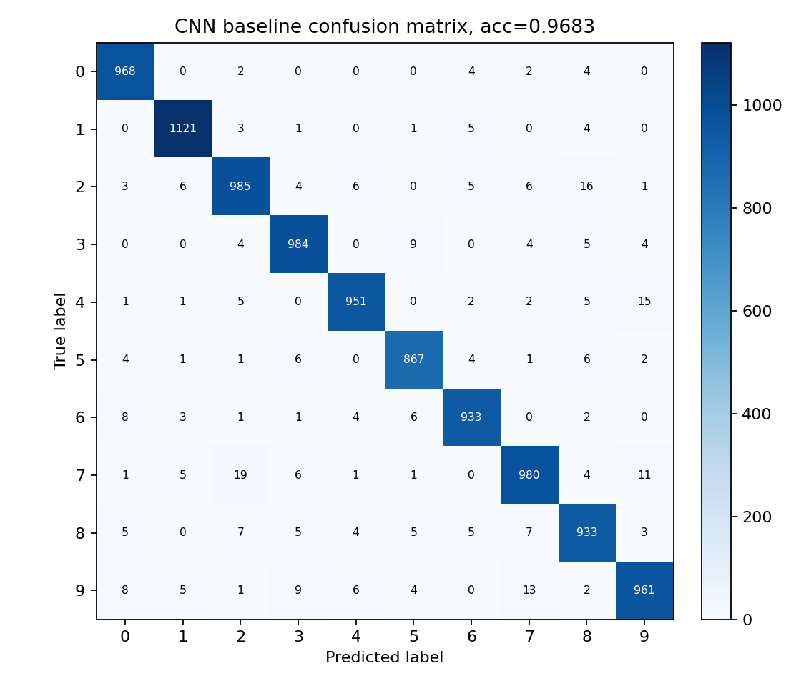
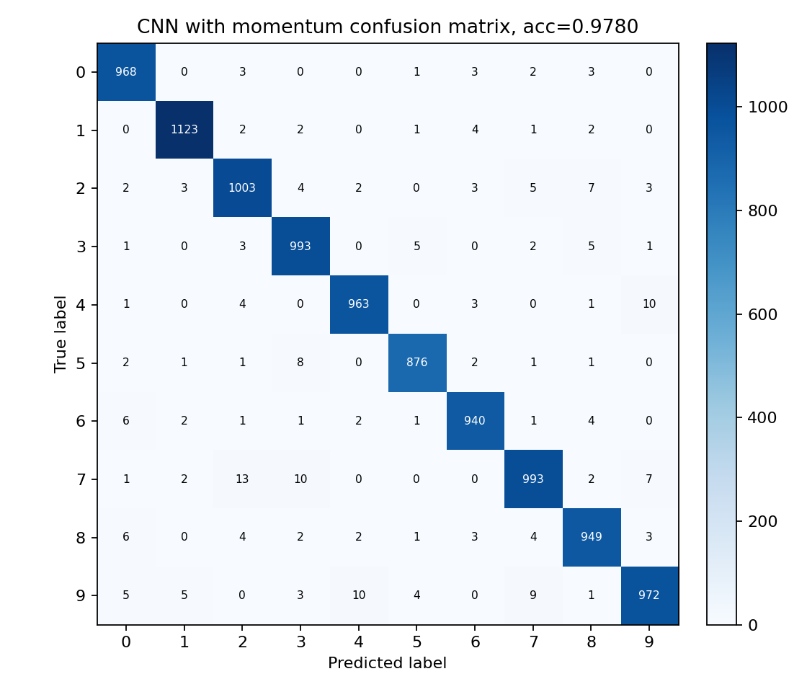
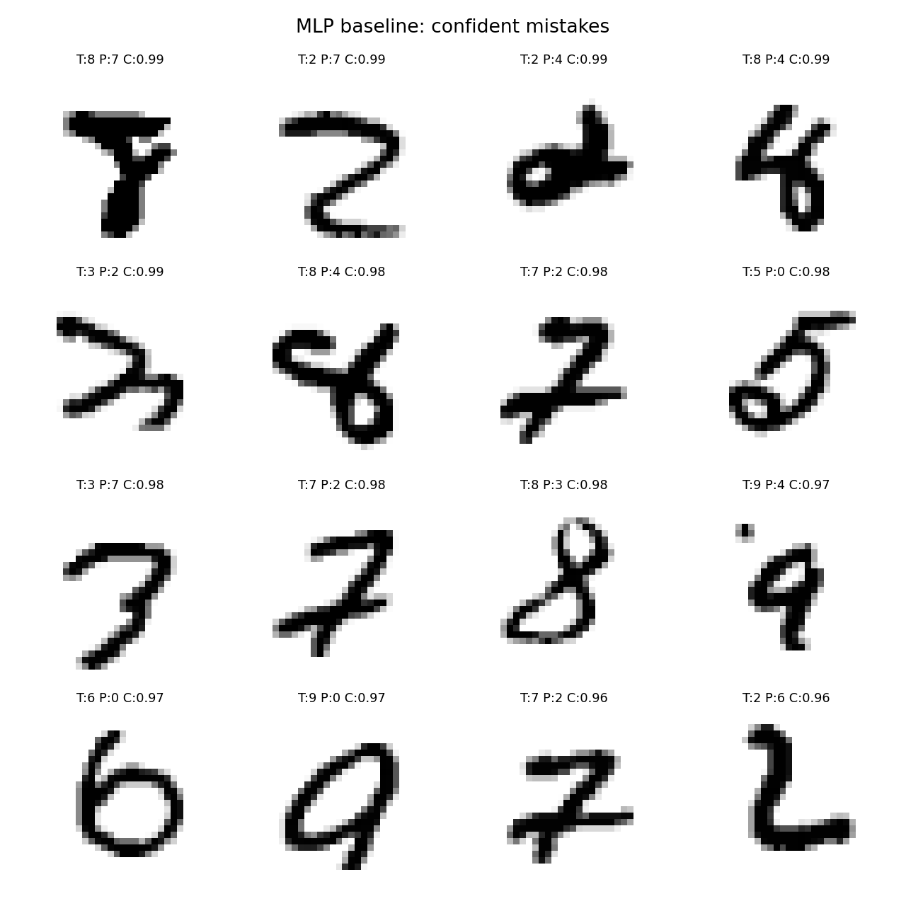
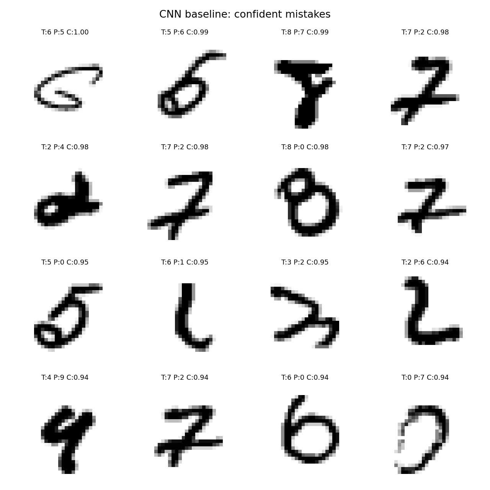
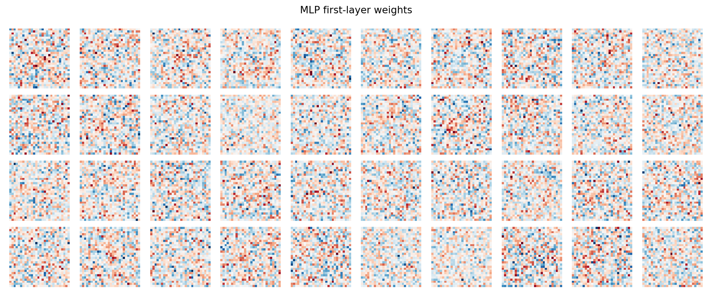
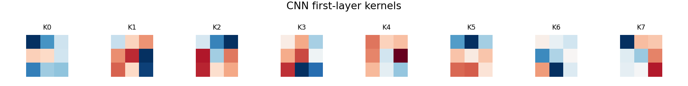

# 1. 实验目的

本次项目的目标是在不调用深度学习框架现成算子的前提下，用 NumPy 实现一个可以训练的神经网络，并在 MNIST 手写数字数据集上完成分类实验。我主要完成了线性层的前向和反向传播、带 softmax 的多分类交叉熵损失、二维卷积层、MLP baseline 和一个简单 CNN。除了必做的 MLP 与 CNN 对比外，我还做了两个附加实验，分别考察 momentum 优化和 L2 正则化的影响。

代码仓库链接为 https://github.com/Yonder-Solivagant/FDU_NNDL_PJ1。训练好的模型权重没有直接放进代码仓库，而是作为 release 附件单独上传，链接为 https://github.com/Yonder-Solivagant/FDU_NNDL_PJ1/releases/tag/v1.0.0。

# 2. 实现方法

核心代码主要在 `codes/mynn/op.py` 和 `codes/mynn/models.py` 中。`Linear` 层的前向传播就是计算 \(XW+b\)，反向传播时分别计算输入梯度、权重梯度和偏置梯度。交叉熵损失函数中包含 softmax，反向传播使用 \((p-y)/N\) 作为对 logits 的梯度，其中 \(p\) 是 softmax 后的概率，\(N\) 是 batch size。

卷积层 `conv2D` 是自己用 NumPy 写的，没有使用 PyTorch、TensorFlow、SciPy 的卷积函数。具体做法是先根据 padding 得到扩展后的输入，然后用循环遍历输出特征图上的每个位置，把对应的感受野 patch 展开成矩阵，最后和卷积核展开后的矩阵相乘。反向传播时也按相同的展开顺序计算卷积核梯度，并把输入梯度加回原来的空间位置。为了确认实现没有形状或顺序错误，我对卷积层做了有限差分梯度检查，权重梯度和输入梯度的误差都在 \(10^{-11}\) 量级。

MLP baseline 使用一层隐藏层。输入是 784 维的展开图像，中间层有 600 个 ReLU 神经元，最后输出 10 个类别的 logits。CNN 模型保持得比较简单，只使用一个 \(3 \times 3\) 卷积层，包含 8 个卷积核，stride 为 1，padding 为 1。卷积层之后接 ReLU、flatten 和一个线性分类器。这个 CNN 不是为了追求最复杂的结构，而是为了观察加入局部连接和权重共享后，模型相对 MLP 的变化。

# 3. 实验设置

我从 MNIST 的 60000 张训练图片中随机取 10000 张作为验证集，剩下的 50000 张用于训练。最终测试结果在官方 10000 张测试图片上计算。所有图片都除以 255 归一化到 \([0,1]\) 区间。除特别说明外，训练使用 batch size 64，训练 5 个 epoch，随机种子设为 309。学习率调度器采用 MultiStepLR，在第 800、2400 和 4000 次迭代时将学习率乘以 0.5。

# 4. 主要结果

| 实验 | 主要设置 | 最优验证准确率 | 测试准确率 | 模型文件 |
| :--- | :--- | ---: | ---: | :--- |
| MLP 基线模型 | SGD，不使用 L2 | 94.48% | 94.77% | `codes/best_models/mlp_baseline/best_model.pickle` |
| CNN 基线模型 | SGD，不使用 L2 | 96.54% | 96.83% | `codes/best_models/cnn_baseline/best_model.pickle` |
| CNN 加 Momentum | Momentum，\(\mu=0.9\)，学习率 0.03 | 97.80% | 97.80% | `codes/best_models/cnn_momentum/best_model.pickle` |
| CNN 加 L2 | SGD，L2 系数 \(10^{-4}\) | 96.55% | 96.82% | `codes/best_models/cnn_l2/best_model.pickle` |

从结果看，简单 CNN 已经明显超过 MLP baseline。MLP 的测试准确率为 94.77%，CNN baseline 提升到 96.83%。在 CNN 上加入 momentum 后，测试准确率进一步提升到 97.80%。L2 正则化在这组实验中的影响很小，测试准确率基本没有变化。

# 5. MLP 基线模型

MLP 的结果可以作为一个比较稳的 baseline。它能够从展开后的像素向量中学习到有效的数字模式，但这种结构没有直接利用图像的空间关系。换句话说，模型知道每个像素的位置，却没有天然地把相邻像素当作局部结构来处理。因此，对于边缘、笔画和局部形状这类图像特征，MLP 只能依靠数据自己慢慢学出来。



从学习曲线看，MLP 的 loss 在训练早期下降很快，后面逐渐变平。验证准确率最终稳定在 94% 到 95% 左右，没有出现非常明显的过拟合。

# 6. CNN 与 MLP 的对比

CNN baseline 的测试准确率为 96.83%，比 MLP 高 2.06 个百分点。这个结果符合对图像分类任务的直觉。MNIST 图片中的数字由局部笔画组成，同一种局部结构可能出现在图片的不同位置。卷积核在整张图上共享参数，正好适合捕捉这种重复出现的局部模式。相比之下，MLP 把图片直接拉平成向量，虽然也能学习有效特征，但需要更多参数去表示空间结构。



需要说明的是，这里的 CNN 只有一层卷积，所以它并不是一个很强的网络。即便如此，它仍然超过了 MLP baseline。这说明在 MNIST 这类图像数据上，卷积带来的归纳偏置本身就有帮助。

# 7. 附加实验一 Momentum 优化

第一个附加方向选择了优化方法。我在 CNN baseline 的基础上把 SGD 换成 Momentum，动量系数设为 0.9。由于 momentum 会累积历史梯度方向，如果继续使用原来的学习率，更新可能过大，所以这里把学习率从 0.06 调低到 0.03。

实验结果比较明显。CNN baseline 的最优验证准确率为 96.54%，测试准确率为 96.83%。加入 momentum 后，最优验证准确率和测试准确率都达到 97.80%。从学习曲线也能看到，momentum 版本在训练前期下降更快，后期也能达到更高的准确率。



这说明 momentum 在这个任务中确实有帮助。我的理解是，普通 mini-batch SGD 每一步都受当前 batch 的影响比较大，而 momentum 会保留一部分过去的更新方向，使参数更新更平滑，也更容易沿着一致的下降方向前进。

# 8. 附加实验二 L2 正则化

第二个附加方向选择了正则化。我在 CNN baseline 上加入 L2 正则化，系数设为 \(10^{-4}\)。这组实验的结果和 baseline 几乎相同，验证准确率从 96.54% 变为 96.55%，测试准确率从 96.83% 变为 96.82%。


这个结果说明，在当前模型规模和训练轮数下，CNN 并没有严重过拟合。模型本身比较小，而且只训练 5 个 epoch，所以 L2 正则化能发挥的空间有限。如果使用更大的 CNN 或训练更多轮，L2 可能会体现出更明显的作用。

# 9. 可视化与错误分析

为了更具体地观察模型的行为，我画了 MLP、CNN baseline 和 CNN with momentum 的混淆矩阵。MLP 中比较明显的错误包括把 9 识别成 4、把 4 识别成 9，以及把 7 识别成 9 或 2。CNN 减少了很多这类错误，但 7 和 2 仍然比较容易混淆。加入 momentum 后，整体错误进一步减少，不过剩下的主要错误仍然集中在形状相近的数字对上，例如 7 和 2、9 和 4。







我还挑出了模型最有信心但预测错误的一些样本。这些样本能反映模型比较“坚定”地犯错的情况。观察后可以发现，很多错误样本本身就比较潦草，有些 7 写得接近 2，有些 4 和 9 的上半部分很像。也就是说，剩余错误不完全是模型能力不足造成的，数据本身的歧义也占了一部分原因。





最后，我把 MLP 第一层的部分权重 reshape 成 \(28 \times 28\) 的图片，也画出了 CNN 第一层的卷积核。MLP 的权重看起来更像一些全局模板或粗糙的笔画检测器，而 CNN 的卷积核只关注局部区域，更接近局部边缘或对比度模式。这和前面的实验结果是一致的。CNN 用更直接的方式建模图像局部结构，因此在这个任务上表现更好。





# 10. 总结

本次实验中，MLP baseline 已经可以达到接近 95% 的测试准确率，但 CNN 只用一个简单卷积层就提升到了 96.83%。这说明卷积结构确实更适合处理图像数据。Momentum 是最有效的附加改动，它把 CNN 的测试准确率提高到 97.80%。相比之下，L2 正则化在这次实验中影响不大，主要原因可能是模型规模较小，训练时间也不长。

从错误分析看，模型剩下的错误主要集中在视觉上相似的数字之间，例如 7 和 2、4 和 9、5 和 3。这些错误有时连人看起来也不太确定。后续如果继续改进，可以考虑更深的 CNN、数据增强，或者专门针对这些易混类别做进一步分析。

# 11. 复现实验

在 `codes` 目录下运行以下命令可以复现实验。

```powershell
python .\test_train.py --model mlp --optimizer sgd --scheduler multistep --weight-decay 0 --num-epochs 5 --batch-size 64 --log-iters 200 --run-name mlp_baseline
python .\test_train.py --model cnn --optimizer sgd --scheduler multistep --weight-decay 0 --num-epochs 5 --batch-size 64 --log-iters 200 --run-name cnn_baseline
python .\test_train.py --model cnn --optimizer momentum --scheduler multistep --weight-decay 0 --lr 0.03 --num-epochs 5 --batch-size 64 --log-iters 200 --run-name cnn_momentum
python .\test_train.py --model cnn --optimizer sgd --scheduler multistep --weight-decay 0.0001 --num-epochs 5 --batch-size 64 --log-iters 200 --run-name cnn_l2
```

训练完成后，可以用下面的命令在测试集上评估模型。

```powershell
python .\test_model.py --model-path .\best_models\mlp_baseline\best_model.pickle
python .\test_model.py --model-path .\best_models\cnn_baseline\best_model.pickle
python .\test_model.py --model-path .\best_models\cnn_momentum\best_model.pickle
python .\test_model.py --model-path .\best_models\cnn_l2\best_model.pickle
```

可视化结果由下面的脚本生成。

```powershell
python .\analyze_results.py
```
